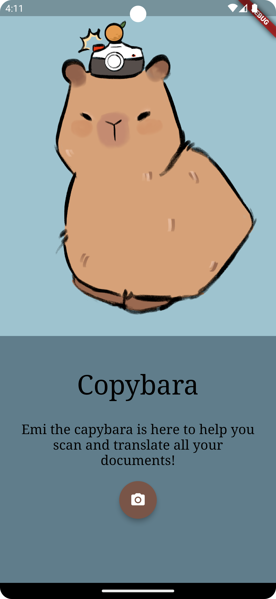
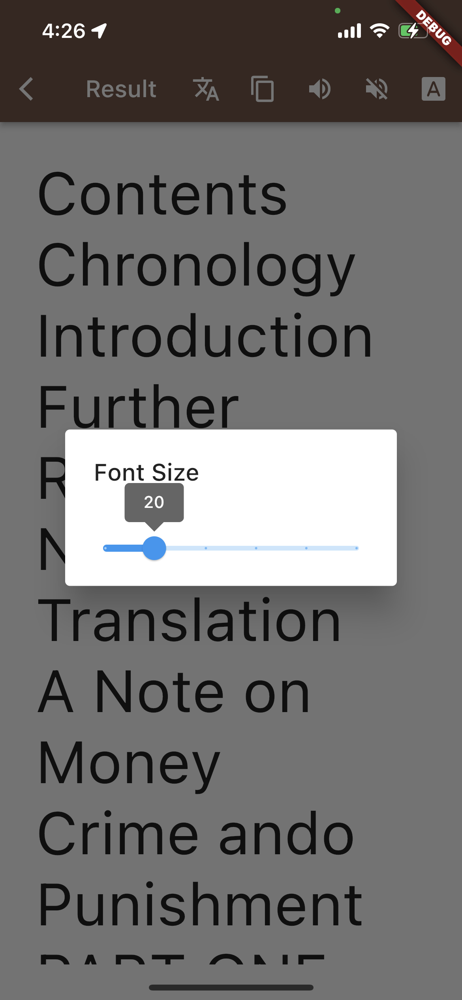
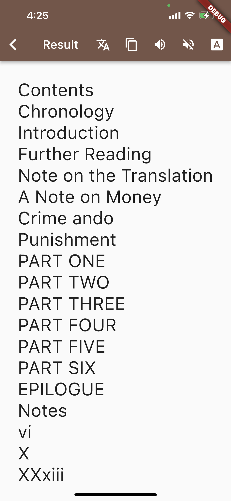

# Copybara 
Easily process difficult to read handwriting, scan text and even translate with Copybara. Utilizng the latest machine learning technology, Copybara is an OCR (Optical Character Recognition) cross-platform application for both iOS and Android. Customly designed, Emi the capybara is your companion for all scanning needs!

## Features
- Scan any form of typed text in real time
- Minimalistic and user friendly UI/UX design
- Enlarge font for readibility
- Copy text to clipboard to share
- Text to speech capabilites to read text out loud

## Screenshots
  

## Screen Recordings

https://github.com/mliu6723/Copybara/assets/43155520/ab40bdb5-0a00-4c0a-97cf-2eae6e63fe63

